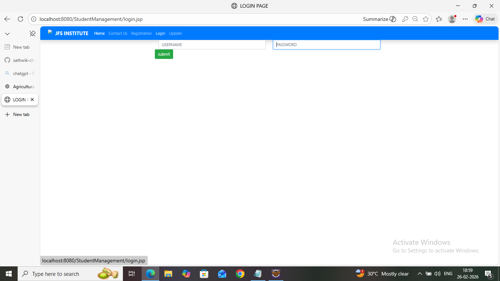
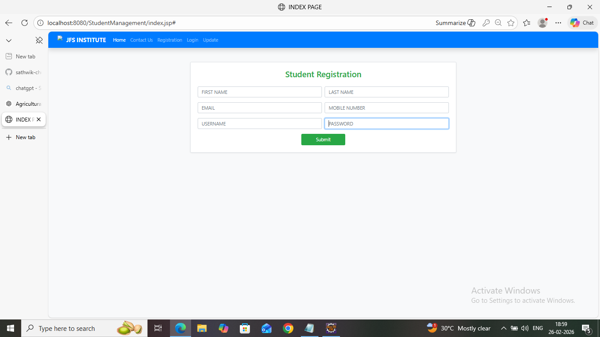
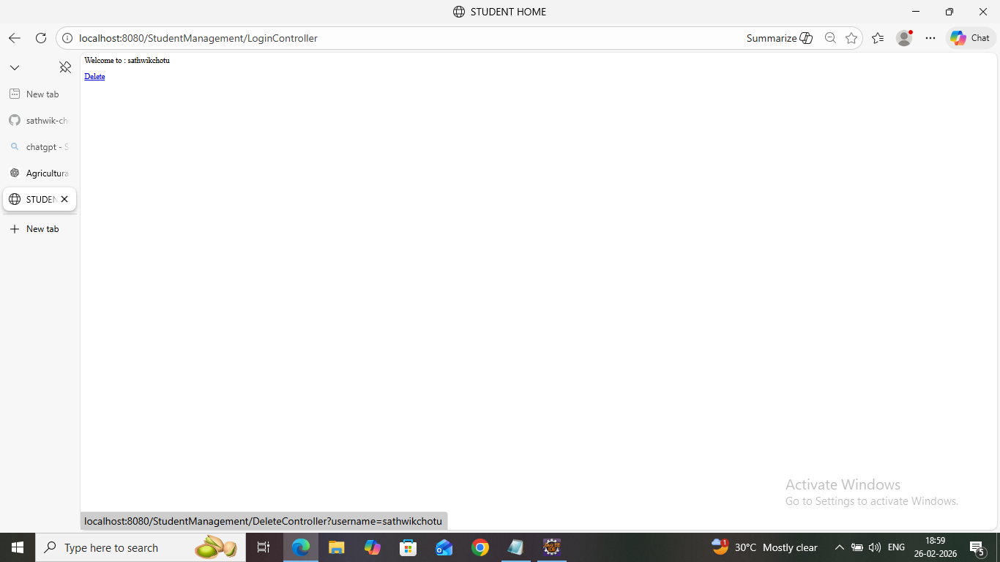
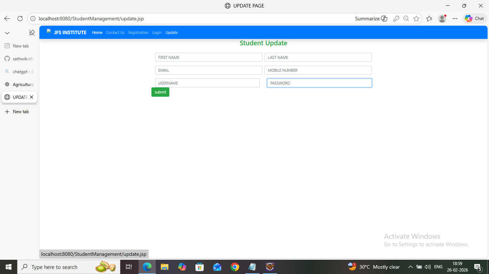

# 🎓 Student Management System

A Java Web-Based Student Management System developed using JSP, Servlets, JDBC, and MySQL following the MVC (Model-View-Controller) Architecture pattern.

This application performs full CRUD (Create, Read, Update, Delete) operations on student data.

---

## 📌 Project Overview

The Student Management System allows users to:

- ➕ Register Students  
- 🔐 Login  
- 🏠 View Student Dashboard  
- ✏️ Update Student Details  
- ❌ Delete Student Records  

This project demonstrates clean architecture, proper database connectivity, and modular coding practices.

---

## 🚀 Technologies Used

- Java  
- JSP (Java Server Pages)  
- Servlets  
- JDBC  
- MySQL  
- HTML  
- CSS  
- Apache Tomcat Server  

---

# 🏗️ MVC Architecture

This project follows the Model-View-Controller (MVC) design pattern.

---

## 📂 Project Structure
student-management
│
├── src/main/java/com/vcube
│ ├── controller
│ │ ├── LoginController.java
│ │ ├── StudentController.java
│ │ ├── UpdateController.java
│ │ └── DeleteController.java
│ │
│ ├── dao
│ │ ├── StudentDao.java
│ │ └── StudentDaoInterface.java
│ │
│ ├── dto
│ │ ├── Student.java
│ │ └── StudentLogin.java
│ │
│ └── utility
│ └── DBConnection.java
│
├── src/main/webapp
│ ├── index.jsp
│ ├── login.jsp
│ ├── studenthome.jsp
│ ├── update.jsp
│ └── navbar.jsp
│
└── Screenshots
├── studentlogin.png
├── studentRegistration.png
├── studenthome.png
└── studentupdate.png


---

## 🔄 Architecture Flow
    User (Browser)
          │
          ▼
    JSP Pages (View Layer)
          │
          ▼
    Servlets (Controller Layer)
          │
          ▼
    DAO Layer (Model)
          │
          ▼
    MySQL Database

    
---

## 🧠 How It Works

1. User interacts with JSP pages (View Layer).
2. JSP sends request to Servlet (Controller Layer).
3. Servlet processes request and calls DAO methods.
4. DAO connects to MySQL using JDBC.
5. Database performs required operation.
6. Response is returned to JSP and displayed to the user.

---

# 📸 Application Screenshots

## 🔐 Student Login Page


## 📝 Student Registration Page


## 🏠 Student Home Page


## ✏️ Student Update Page


---

# ⚙️ How to Run the Project

1. Clone the repository:

git clone https://github.com/sathwik-chotu/student-management.git

2. Import into Eclipse or IntelliJ IDEA.
3. Configure Apache Tomcat Server.
4. Create a MySQL database.
5. Update database credentials inside DBConnection.java.
6. Deploy the project on Tomcat.
7. Open in browser:

http://localhost:8080/student-management

---

# 🗄️ Database Configuration

```sql
CREATE TABLE student (
    id INT PRIMARY KEY AUTO_INCREMENT,
    name VARCHAR(100),
    email VARCHAR(100),
    password VARCHAR(100),
    course VARCHAR(100)
);

✨ Key Features

✔️ MVC Architecture
✔️ Clean Code Structure
✔️ CRUD Operations
✔️ JDBC Database Connectivity
✔️ Modular Design
✔️ Dynamic Web Pages

👨‍💻 Author

Sathwik Reddy
GitHub: https://github.com/sathwik-chotu